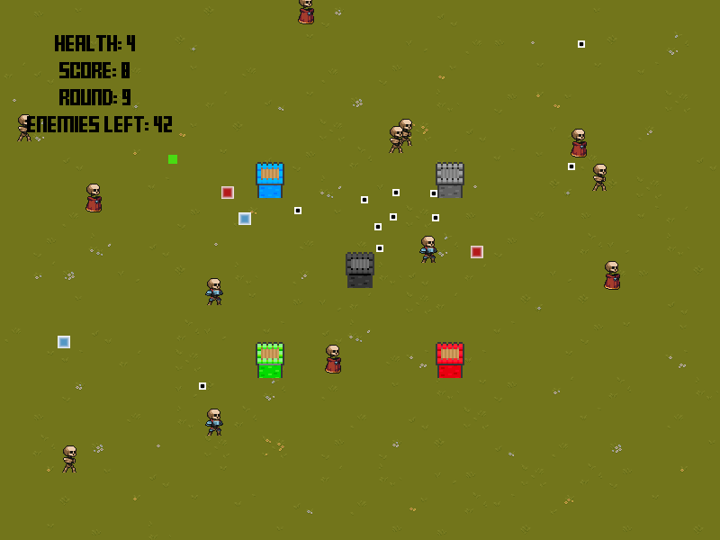

# DEFENDER

## Popis hry

Defender je tower defense hra, ve které hráč ovládá věž a střílí po nepřátelích. Za každé úspěšně dokončené kolo získá hráč možnost vybrat si jedno ze tří možných vylepšení. Vylepšení buď vylepšuje hráče (jeho černou věž), umožní hráči postavit jednu z automatizovaných věží nebo právě tyto automatizované věže vylepšuje.

Po spuštění hry je hráč informován o tom, jak se hra ovládá (Controls window). Hráč je následně přesměrován do hlavního menu (MainMenu window), kde si může zvolit obtížnost a založit novou hru nebo pokračovat v poslední uložené hře.

Během hry na hráče ze stran obrazovky nabíhají nepřátelé a jeho úkol je ničit je projektily vystřelenými z jeho věže. Po zničení všech nepřátel je hráči zobrazeno okno s vylepšeními (Upgrade window), kde hráč dostane na výběr mezi 3 vylepšeními.

Za každé dokončené kolo se hráči zlepšuje skóré, které je dále ovlivněno obtížností na kterou hráč hru hraje. Po úspěšném dokončení kola (a výběru vylepšení) je hra vždy uložena, tak aby si ji hráč mohl po vypnutí hry znovu načíst.

Ve hře se nachází 4 typy věži:

- Červená ‒ Střílí projektily, které po kolizi s nepřítelem explodují a zraní okolní nepřátele
- Zelená ‒ Střílí projektily, které se po kolizi s nepřítelem odrazí směrem k jinému nepříteli
- Modrá ‒ Střílí projektily, které prochází nepřáteli a umožňují tak zranit více nepřátel najednou
- Šedá ‒ Střílí obyčejné projektily, ale je schopna střílet je rychle

Všechny věže kromě modré míří na náhodné nepřátele, modrá věž míří na nejbližšího nepřítele.

Ve hře jsou dále 3 druhy nepřátel, které se kromě vzhledu liší počtem životů i rychlostí pohybu.

Podstatná část této hry byla vyvinuta v mém osobním repozitáři - https://gitlab.fit.cvut.cz/machaj52/python-semestralka.

## Popis spuštění

### Závislosti

1, python3 ‒ verze alespoň 3.10 ‒ `sudo apt install python3`

2, pygame ‒ `python3 -m pip install -U pygame --user`

### Spuštění

1, Nainstalujte potřebné závislosti

2, Stáhněte si adresář z tohoto repozitáře 

3, Spusťte adresář ‒ `python3 -m <jmeno_adresare>`

### Testování

1, Nainstalujte pytest ‒ `pip install -U pytest`

2, Spusťte testy ‒ `pytest <jmeno_adresare>` ‒ Nelekněte se spouštěných oken při testování. Pygame vyžaduje před načtením obrázků z adresářů spustit okno.

3, Nainstalujte pylint ‒ `pip install -U pytest`

4, Spusťte pylint ‒ `pylint <jmeno_adresare> --disable=C0103,C0301,C0413,R0801,R0902,R0903,R0913`

## Použité grafické assety

- Herní pozadí - https://cainos.itch.io/pixel-art-top-down-basic
- Věže - https://merchant-shade.itch.io/16x16-mini-world-sprites
- Nepřátelé - https://anokolisa.itch.io/dungeon-crawler-pixel-art-asset-pack
- Herní font - https://www.1001fonts.com/fff-forward-font.html
- Ukazatel v menu - https://opengameart.org/content/rpg-gui-selection-arrow